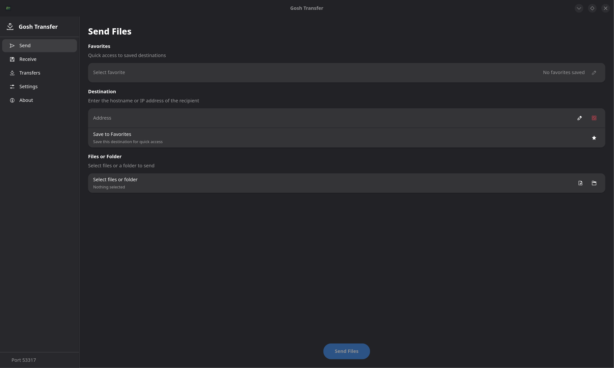
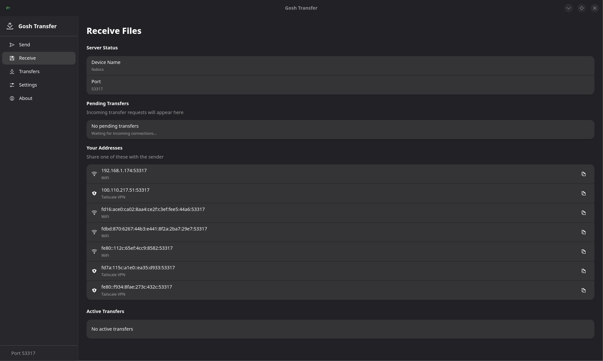
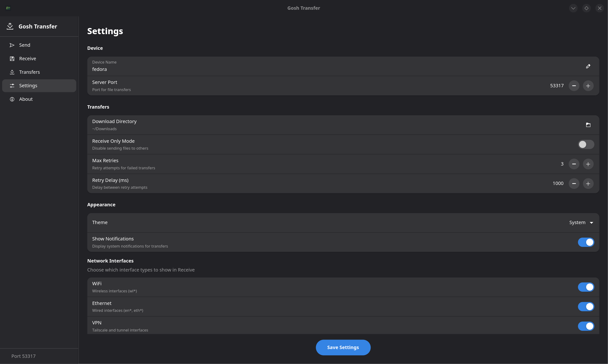
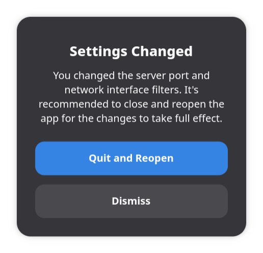

# Gosh Transfer

A cross-platform desktop application for explicit file transfers over LAN, Tailscale, and VPNs.

## Philosophy

Gosh apps are built with a Linux-first mindset: simplicity, transparency, and user control.

We also provide Windows and macOS builds not as a compromise, but as an on-ramp. Many people are curious about Linux but still live on other platforms day-to-day. If these tools help someone get comfortable and eventually make the jump, we're happy to meet them where they are.

## What It Does

Gosh Transfer sends files between computers using explicit IP addresses or hostnames. No auto-discovery, no cloud services, no magic you specify where files go.

## Screenshots







## Features

- **Send files** to a specific IP/hostname with drag-and-drop or file picker
- **Receive files** with manual accept/reject for each transfer request
- **Favorites** for saving frequently-used peer addresses
- **Trusted hosts** for auto-accepting transfers from specific IPs
- **Receive-only mode** to disable sending
- **Theme support** (dark/light/system)

## Technical Details

### Architecture

| Component | Technology |
|-----------|------------|
| Backend | Rust + Tauri 2 |
| HTTP Server | Axum 0.8 |
| HTTP Client | Reqwest 0.12 |
| Frontend | Svelte 5 |
| Bundler | Vite 7 |

### Network Protocol

The application runs an HTTP server on port **53317** (hardcoded, not configurable at runtime).

**Endpoints:**
| Endpoint | Method | Purpose |
|----------|--------|---------|
| `/health` | GET | Connectivity check |
| `/info` | GET | Returns device name and version |
| `/transfer` | POST | Initiate transfer request |
| `/transfer/status` | GET | Poll approval status |
| `/chunk` | POST | Stream file data |
| `/events` | GET | SSE for real-time progress |

**Transfer Flow:**
1. Sender POSTs to `/transfer` with file metadata
2. If trusted host: immediate acceptance with token
3. Otherwise: receiver sees approval prompt, sender polls `/transfer/status`
4. On accept: sender streams each file to `/chunk` with token
5. Receiver writes to download directory with conflict resolution (`file (1).ext`, etc.)

### Data Storage

Settings and favorites are stored in the OS-appropriate config directory:
- Linux: `~/.config/gosh-transfer/`
- macOS: `~/Library/Application Support/com.gosh.transfer/`
- Windows: `%APPDATA%\gosh\transfer\config\`

Files:
- `settings.json` - Application settings
- `favorites.json` - Saved peers

**Note:** Transfer history is stored in memory only and is lost when the application closes.

### Settings

| Setting | Type | Default | Description |
|---------|------|---------|-------------|
| `port` | u16 | 53317 | Stored but not applied at runtime |
| `deviceName` | string | hostname | Shown to peers |
| `downloadDir` | path | OS Downloads folder | Where received files are saved |
| `trustedHosts` | string[] | [] | IPs for auto-accept (exact match only) |
| `receiveOnly` | bool | false | Hides Send tab |
| `notificationsEnabled` | bool | true | Stored but not implemented |
| `theme` | string | "system" | "dark", "light", or "system" |

## Building

### Prerequisites

- Node.js 18+
- Rust 1.70+
- Platform-specific dependencies for Tauri

### Development

```bash
npm install
npm run tauri dev
```

### Production Build

```bash
npm run tauri build
```

Outputs: AppImage, .deb, .rpm (Linux), .exe/.msi (Windows), .dmg (macOS)

## Known Limitations

1. **Port is hardcoded** - The port setting in the UI is saved but the server always binds to 53317
2. **IPv4 only** - Despite code comments, the server binds only to `0.0.0.0`
3. **No transfer speed display** - Speed calculation is not implemented (always shows 0)
4. **System notifications** - Setting exists but notifications are not sent
5. **Trusted hosts use exact IP match** - Hostnames in trusted hosts won't work without prior resolution
6. **Transfer history volatile** - Lost on application close

## Disclaimer

This application is an independent project and is not sponsored by, endorsed by, or affiliated with Localsend or GitHub, Inc.

This software is licensed under the GNU Affero General Public License v3.0 (AGPL-3.0). It is provided "as is", without warranty of any kind, express or implied, including but not limited to the warranties of merchantability or fitness for a particular purpose. Use at your own risk.

## License

AGPL-3.0 - See [LICENSE](LICENSE)

